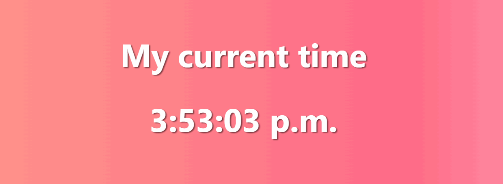

# React Current Time

## 🦉 Main information

A simple React application showing your real current time.

The project goal:
- create simple React application showing your current time;
- use React class component;
- create a new Date object for the current time;
- use toLocaleDateString() method to return a string with a language-sensitive representation of the date portion of this date in the local timezone;
- use componentDidMount() method to set interval;
- use componentWillUnmount() method to clear interval;
- add CSS to make it look nice;